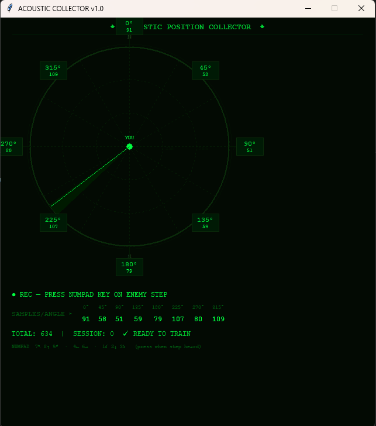
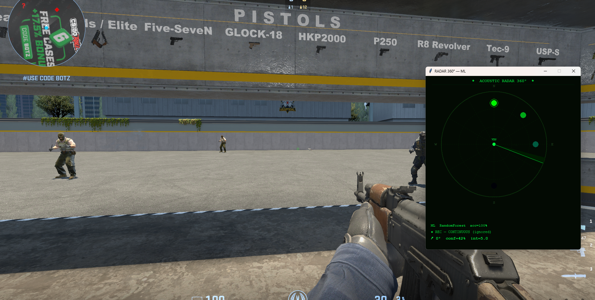

# Acoustic ESP — Acoustic Radar

> 🇺🇸 **English** | [🇧🇷 Português abaixo](#-acoustic-esp--radar-acústico-pt-br)

---

## Demonstration

Example video in the repository root: [`demonstration.mp4`](demonstration.mp4)

<video src="demonstration.mp4" controls playsinline width="100%"></video>

---

## Quick Reference

| File | Use when… |
|------|-----------|
| `collector.py` | **Record training data**: label steps by direction → generates `samples.csv` |
| `train.py` | You have samples and want to generate **`model.pkl`** |
| **`radar_ml.py`** | **Main radar**: stereo + **ML model** (`model.pkl`) |
| **`radar_surround.py`** | Test **radar without ML**, via **multiple channels** (5.1/7.1) when the driver exposes surround |

### Screenshots

| Collector UI | In-game Demo |
|:---:|:---:|
|  |  |

---

## Overview

**Acoustic radar** project: estimate **direction (angle)** and **relative distance** to the player from captured audio (e.g. footsteps), using **stereo + machine learning**, instead of relying on 8 raw surround 7.1 channels.

---

## How it Works & Difference from "7.1 ESP"

Many approaches try to read each virtual speaker of the **7.1 mix** (FL, FR, RL, RR, etc.) to determine sound origin. This repository takes a different path:

1. Capture a **stereo** signal (L/R) routed through a virtual cable (e.g. VB-Audio Cable)
2. Extract **frequency-domain features** — L/R correlation, phase, energy per band — the same cues the brain uses with two ears
3. Train a **scikit-learn** classifier to map those features to discrete **angles** (0°, 45°, …, 315°), using **intensity** as a proxy for distance

When the game outputs audio through **HRTF** (*Head-Related Transfer Function*), the stereo pair already encodes directional information — no need to decode 7.1 channel by channel. The model learns those patterns directly from the L/R signal.

> `radar_surround.py` is the heuristic/multichannel variant for when the device exposes 6+ channels. The main recommended flow is **`collector.py` → `train.py` → `radar_ml.py`**.

---

## Roadmap

| Phase | Status | Description |
|-------|--------|-------------|
| Acoustic radar | ✅ Current | Direction + relative distance on a 2D radar from sound events |
| Acoustic wallhack | 🔜 Planned | Keep last estimated position / recent trail on screen, not just a momentary ping |

> Phase 2 depends on minimap/world space integration.

---

## Prerequisites

- Python 3.10+ (3.11 or 3.12 recommended on Windows)
- A **7.1 audio device** set as primary output — or a virtual one (see setup below)
- **VB-Audio Virtual Cable** or equivalent for audio routing

---

## Step 1 — Audio Device Setup

> **Reference / inspiration:** [CanetisRadar by SamuelTulach](https://github.com/SamuelTulach/CanetisRadar)

You need a **7.1 surround device** as your default playback device. Check if your sound card or headset already supports it — if it does, skip to Step 2.

Otherwise, use a virtual audio device:

1. Download **[VB-Cable](https://www.vb-audio.com/Cable/)** *(or the better alternative: **[Razer Surround](https://www.razer.com/surround)**)*
2. Install and **reboot your PC**
3. Open **Sound Settings → Playback tab**
4. Set **CABLE Input** as the default device
5. Click **Configure** → select **7.1 Surround** and enable all speakers
6. Go to **Recording tab** → click **CABLE Output** → **Properties**
7. Go to **Listen tab** → check **"Listen to this device"**
8. Set your actual headphones/speakers as the playback device
9. Done — game audio now routes through the virtual 7.1 device

---

## Step 2 — Python Setup

1. Install Python at [python.org](https://www.python.org/downloads/) — check **"Add python.exe to PATH"**

2. Create a virtual environment:
```powershell
cd C:\path\to\acoustic-esp
python -m venv .venv
.\.venv\Scripts\activate
```

3. Install dependencies:
```powershell
pip install -r requiriments.txt
```

4. **PyAudio on Windows** — if `pip install PyAudio` fails, try:
   - [Unofficial wheel](https://www.lfd.uci.edu/~gohlke/pythonlibs/#pyaudio) — download the `.whl` for your Python version and run `pip install <file>.whl`
   - Or: `pip install pipwin` then `pipwin install pyaudio`

5. **Tkinter** — bundled with the official Python installer. If missing, reinstall Python and check the **tcl/tk** component.

---

## Step 3 — Running

| # | Command | What it does |
|---|---------|--------------|
| 1 | `python collector.py` | Opens UI — press **numpad keys** as you hear footsteps to label directions → saves `samples.csv` |
| 2 | `python train.py` | Reads `samples.csv`, trains classifier, saves `model.pkl` |
| 3 | `python radar_ml.py` | Loads `model.pkl` + live stereo audio → shows directional pings on radar |

**Optional:** `python radar_surround.py` — heuristic radar without ML, uses surround channels if the device exposes 6+.

---

## Files

| File | Purpose |
|------|---------|
| `collector.py` | Labeled data collection → `samples.csv` |
| `train.py` | Model training → `model.pkl` |
| `radar_ml.py` | **Main radar** — stereo + ML |
| `radar_surround.py` | Heuristic multichannel radar |
| `requiriments.txt` | pip dependencies |
| `demonstration.mp4` | Demo video |

---

## Ethical & Usage Note

Using tools that alter competitive advantage in **online games** may violate the game's **terms of service** and result in a ban. This project is shared for technical transparency — use at your own responsibility.

---
---

# 🇧🇷 Acoustic ESP — Radar Acústico (PT-BR)

---

## Demonstração

Vídeo de exemplo na raiz do repositório: [`demonstration.mp4`](demonstration.mp4)

<video src="https://raw.githubusercontent.com/Withoutbytes/acoustic-esp/main/demonstration.mp4" controls width="100%">
</video>

---

## Guia rápido

| Arquivo | Use quando… |
|---------|-------------|
| `collector.py` | Quiser **gravar treino**: rotular passos por direção → gera `samples.csv` |
| `train.py` | Já tiver amostras e quiser gerar **`model.pkl`** |
| **`radar_ml.py`** | **Radar principal**: estéreo + **modelo ML** (`model.pkl`) |
| **`radar_surround.py`** | Quiser testar **radar sem ML**, por **vários canais** (5.1/7.1) quando o driver expõe surround |

### Prints

| Collector UI | Demo em jogo |
|:---:|:---:|
|  |  |

---

## Visão geral

Projeto de **radar acústico**: estimar **direção (ângulo)** e **distância relativa** ao jogador a partir do som capturado (ex.: passos), usando **estéreo + aprendizado de máquina**, em vez de depender de 8 canais crus de surround 7.1.

---

## Como funciona e diferença do "ESP por 7.1"

Muitas abordagens tentam ler cada alto-falante virtual do mix **7.1** (FL, FR, RL, RR, etc.) para detectar a origem do som. Esse projeto toma um caminho diferente:

1. Captura um sinal **estéreo** (L/R) roteado por um cabo virtual (ex.: VB-Audio Cable)
2. Extrai **features no domínio da frequência** — correlação L/R, fase, energia por banda — as mesmas pistas que o cérebro usa com dois ouvidos
3. Treina um classificador **scikit-learn** para mapear essas features para **ângulos** discretos (0°, 45°, …, 315°), usando **intensidade** como proxy de distância

Quando o jogo usa **HRTF** (*Head-Related Transfer Function*), o par estéreo já carrega informação direcional — não é necessário decodificar 7.1 canal a canal. O modelo aprende esses padrões diretamente do sinal L/R.

> `radar_surround.py` é a variante heurística/multicanal para quando o dispositivo expõe 6+ canais. O fluxo principal recomendado é **`collector.py` → `train.py` → `radar_ml.py`**.

---

## Roadmap

| Fase | Status | Descrição |
|------|--------|-----------|
| Radar acústico | ✅ Atual | Direção + distância relativa no radar 2D a partir de eventos sonoros |
| Wallhack acústico | 🔜 Planejado | Manter última posição estimada / trilha recente na tela, não só um ping momentâneo |

> Fase 2 depende de integração com minimapa/world space.

---

## Pré-requisitos

- Python 3.10+ (recomendado 3.11 ou 3.12 no Windows)
- Um **dispositivo de áudio 7.1** definido como saída principal — ou um virtual (veja o setup abaixo)
- **VB-Audio Virtual Cable** ou equivalente para roteamento de áudio

---

## Etapa 1 — Configuração do dispositivo de áudio

> **Referência / inspiração:** [CanetisRadar by SamuelTulach](https://github.com/SamuelTulach/CanetisRadar)

É necessário um **dispositivo surround 7.1** como saída padrão. Verifique se sua placa de som ou headset já suporta — se sim, pule para a Etapa 2.

Caso contrário, use um dispositivo virtual:

1. Baixe o **[VB-Cable](https://www.vb-audio.com/Cable/)** *(ou a alternativa melhor: **[Razer Surround](https://www.razer.com/surround)**)*
2. Instale e **reinicie o PC**
3. Abra **Configurações de Som → aba Reprodução**
4. Defina **CABLE Input** como dispositivo padrão
5. Clique em **Configurar** → selecione **Surround 7.1** e habilite todos os alto-falantes
6. Vá para a **aba Gravação** → clique em **CABLE Output** → **Propriedades**
7. Vá para a **aba Ouvir** → marque **"Ouvir este dispositivo"**
8. Selecione seu fone/caixa real como dispositivo de reprodução
9. Pronto — o áudio do jogo agora passa pelo dispositivo 7.1 virtual

---

## Etapa 2 — Setup do Python

1. Instale o Python em [python.org](https://www.python.org/downloads/) — marque **"Add python.exe to PATH"**

2. Crie um ambiente virtual:
```powershell
cd C:\caminho\para\acoustic-esp
python -m venv .venv
.\.venv\Scripts\activate
```

3. Instale as dependências:
```powershell
pip install -r requiriments.txt
```

4. **PyAudio no Windows** — se `pip install PyAudio` falhar:
   - [Wheel não oficial](https://www.lfd.uci.edu/~gohlke/pythonlibs/#pyaudio) — baixe o `.whl` para sua versão do Python e rode `pip install <arquivo>.whl`
   - Ou: `pip install pipwin` depois `pipwin install pyaudio`

5. **Tkinter** — vem com o instalador oficial. Se faltar, reinstale o Python marcando o componente **tcl/tk**.

---

## Etapa 3 — Rodando

| # | Comando | O que faz |
|---|---------|-----------|
| 1 | `python collector.py` | Abre a UI — pressione teclas do **numpad** ao ouvir passos para rotular direções → salva `samples.csv` |
| 2 | `python train.py` | Lê `samples.csv`, treina o classificador, salva `model.pkl` |
| 3 | `python radar_ml.py` | Carrega `model.pkl` + áudio estéreo ao vivo → exibe pings direcionais no radar |

**Opcional:** `python radar_surround.py` — radar heurístico sem ML, usa canais surround se o dispositivo expõe 6+.

---

## Arquivos

| Arquivo | Função |
|---------|--------|
| `collector.py` | Coleta rotulada → `samples.csv` |
| `train.py` | Treino do modelo → `model.pkl` |
| `radar_ml.py` | **Radar principal** — estéreo + ML |
| `radar_surround.py` | Radar heurístico multicanal |
| `requiriments.txt` | Dependências pip |
| `demonstration.mp4` | Vídeo de demonstração |

---

## Nota ética e de uso

Usar ferramentas que alterem vantagem competitiva em **jogos online** pode violar os **termos de serviço** do jogo e resultar em banimento. Este projeto é compartilhado por transparência técnica — o uso é de sua responsabilidade.